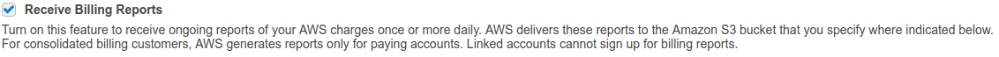

## Read AWS Billing Reports into AWS Athena with Python and AWS Lambda

This library is meant to help those who would like to read their AWS
billing reports through Athena.

This can be done for different reasons: maybe you just want to easily read your
billing data, or maybe you also want to visualize them and you don't like AWS Cost Explorer.

There are other ways to do exactly what I just described, __but__:
* it's Python
* it's all transparent: this guide tells you what permissions your lambda will need, and you won't have to give any more than that.

If you don't care about any of the above, I suggest you use the cloudformation
provided in [this](https://aws.amazon.com/blogs/big-data/query-and-visualize-aws-cost-and-usage-data-using-amazon-athena-and-amazon-quicksight/)
blog post from AWS blog itself.

It basically produces the same result, with the difference that you won't have a lot of control over which function does what.

### How to deploy

Well, it's actually super simple.

#### 1. Activate billing reports
If you are searching for this tool, you probably have your AWS Billing Report enabled, but better safe than sorry:

The __Detailed Billing Report with Resources and Tags__ can be activated
from the _preferences_ entry in the _billing_ menu by ticking the appropriate option, like so:

#### 2. Create an Athena database to store all your billing information
Just create a Database using the wizard and keep the name handy.

#### 3. Create an AWS role
Create a IAM role with read-write access to the billing bucket, as well as access to Athena.

#### 4. Create a Lambda function
* Using the wizard, just choose `Author from scratch` and then use the role you just created
* Go into the settings and give it all the possible memory, as well as a timeout of at least 2 minutes
* Set up a trigger for the billing bucket, and keep the default `Object Created (All)` setting.
You don't need to necessarily use prefixes or suffixes, as the lambda has a regex check in it. But they don't hurt.

#### 5. Personalize all the things!
Now you need to substitute the names of:
* your billing bucket (something like `s3://your-billing-bucket`, the one you specified in step 1.)
* the name of the "folder" where you want to save the unzipped and well ordered csv files (just a plain name, like `for_athena`)
* the Athena db where the table will be created (the name of the db you created in step 2)

You can either do it manually (you will find &&&BUCKET&&&, &&&DB&&& and &&&FOLDER&&& in the code) or use these commands:

* install sed : `sudo apt-get install sed`

* `sed -i 's/&&&DB&&&/your_db_name/g' files_unzipping_and_moving_lambda.py`
* `sed -i 's/&&&BUCKET&&&/your_bucket_name/g' files_unzipping_and_moving_lambda.py`
* `sed -i 's/&&&BUCKET&&&/your_bucket_name/g' table_creation.txt`
* `sed -i 's/&&&FOLDER&&&/your_folder_name/g' files_unzipping_and_moving_lambda.py`
* `sed -i 's/&&&FOLDER&&&/your_folder_name/g' table_creation.txt`

#### 6. Zip the scripts and upload

* `cd code`
* `zip -r lambda.zip lambda_function.py table_creation.txt`

Now in the lambda dashboard choose "upload zip file", then upload the zip!

#### 7. Test

You can set un test cases, or just duplicate one of the zips.
Note that the file you pick should contain `aws-billing-detailed-line-items-with-resources-and-tags` :
that one is the kind used by the script.

Then just check whether a folder has appeared with the name you specified.
Also, the Athena table should appear within a minute or so!

